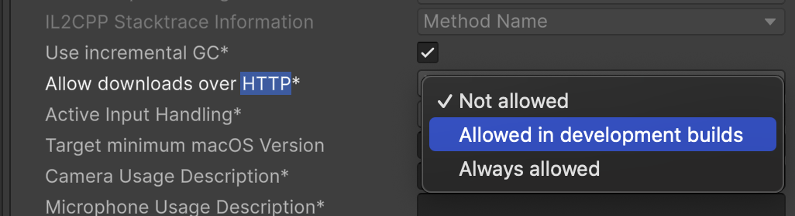

# HTTP Connection Setup
KnowLang binary use http ASGI server to communicate with Unity Client
please enable `Allow HTTP Connection` in Edit > Project Settings > Player > Other Settings > Configuration > Allow downloads over HTTP

